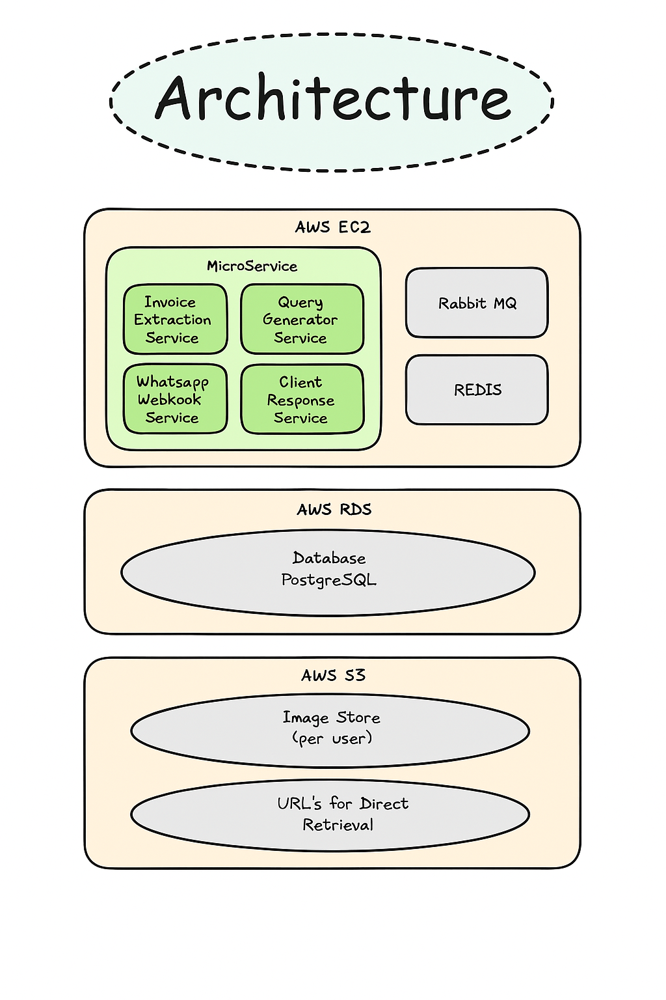
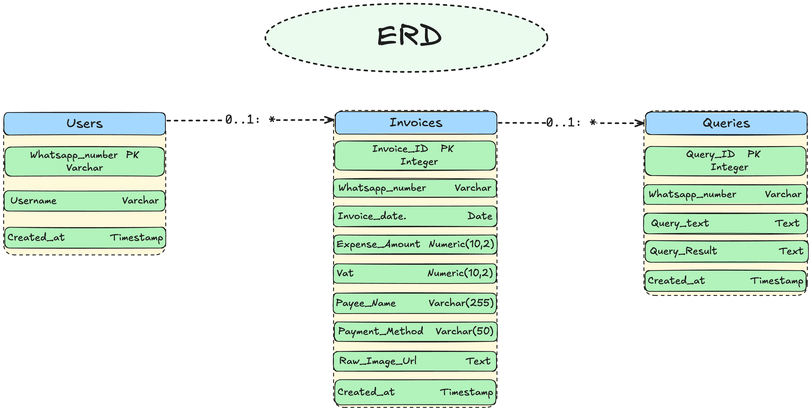
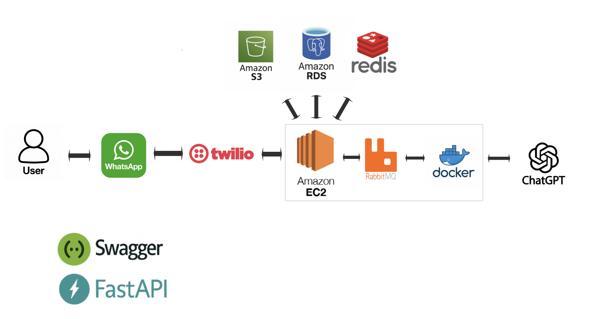
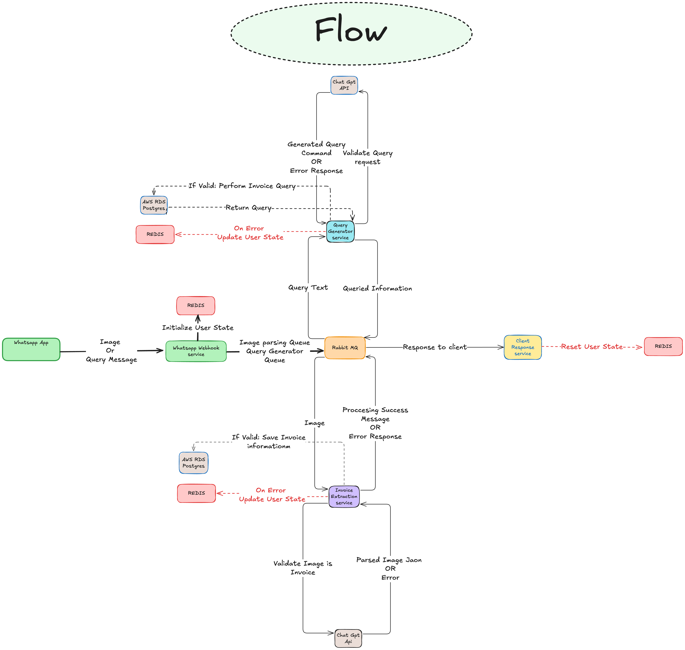

# WhatsApp Invoice Parsing Service

A microservices-based system that processes invoice images and natural language queries through WhatsApp using Twilio, RabbitMQ, OpenAI GPT, AWS S3, and AWS RDS PostgreSQL. The system parses invoice data from images and converts natural language queries into SQL database queries for data retrieval and analysis.

## System Architecture

The system runs on Docker containers (deployable to AWS EC2) hosting four key microservices:
- **Webhook Service**: Receives incoming WhatsApp messages via Twilio, manages user session state with Redis.
- **Invoice Extractor**: Analyzes images using GPT to extract invoice data, stores images in S3 and extracted metadata in RDS.
- **Query Generator**: Processes natural language queries using GPT to analyze data stored in the RDS database and generate Excel reports.
- **Client Response**: Manages responses back to users via Twilio/WhatsApp.

Supporting Infrastructure:
- **RabbitMQ**: Facilitates asynchronous communication and task queuing between microservices.
- **Redis**: Used for state management, managing user conversation flow, and session data.
- **AWS RDS (PostgreSQL)**: Provides persistent storage for user data, extracted invoice information (`fintrak` database), and query history.
- **AWS S3**: Stores the invoice image files securely.

[](https://github.com/DM-Dev-Codes/whatsapp-invoice-processor/blob/main/docs/Infrastructure_Architecture.png)

## Prerequisites

- Docker and Docker Compose
- AWS Account with permissions for:
    - EC2 (Instance creation, Security Group management)
    - RDS (Database creation, Security Group management)
    - S3 (Bucket creation, Object read/write access)
- Twilio Account with an active WhatsApp Sender
- OpenAI API key
- Python 3.9+ (for local development)

## Quick Start

1.  **Clone the repository**
    ```bash
    git clone <your-repository-url> # Replace with your repo URL
    cd whatsapp-invoice-processor
    ```

2.  **Set up environment variables**
    Create a `.env` file in the root directory. **Do not commit this file.** Use the following template:
    ```env
    # AWS Credentials & Configuration
    AWS_ACCESS_KEY_ID=your_access_key
    AWS_SECRET_ACCESS_KEY=your_secret_key
    AWS_REGION=your_aws_region # e.g., us-east-1
    S3_BUCKET_NAME=your_unique_s3_bucket_name

    # RDS PostgreSQL Configuration
    RDS_HOST=your_rds_endpoint
    RDS_PORT=5432
    RDS_DATABASE=fintrak # Database name
    RDS_USER=your_rds_username
    RDS_PASSWORD=your_rds_password

    # Twilio Configuration
    TWILIO_ACCOUNT_SID=your_account_sid
    TWILIO_AUTH_TOKEN=your_auth_token
    TWILIO_PHONE_NUMBER=your_twilio_whatsapp_number # e.g., +14155238886

    # OpenAI Configuration
    GPT_API_KEY=your_openai_api_key

    # Redis Configuration (Defaults for docker-compose)
    REDIS_HOST=redis
    REDIS_PORT=6379

    # RabbitMQ Configuration (Defaults for docker-compose)
    RABBITMQ_HOST=rabbitmq
    RABBITMQ_PORT=5672
    ```

3.  **Build and Start the services**
    ```bash
    docker-compose up --build -d # Build images and run in detached mode
    ```

4.  **Configure Twilio Webhook**
    - In your Twilio console, navigate to the settings for your WhatsApp sender.
    - Set the webhook URL for incoming messages to point to your deployed Webhook Service:
      `http://<your-ec2-public-ip-or-dns>:8000/whatsapp`
      (Ensure port 8000 is open in your EC2 Security Group).

## AWS Setup Guide

This guide assumes basic familiarity with the AWS console.

### 1. S3 Bucket Creation

- Go to the S3 service in the AWS console.
- Create a new bucket. Choose a globally unique name and the desired region.
- Configure permissions:
    - Enable public access to allow anyone to download files. 
    - Attach the "AmazonS3FullAccess" policy to your user.
    - Example policy snippet:
      ```json
      {
          "Version": "2012-10-17",
          "Statement": [
              {
                  "Effect": "Allow",
                  "Principal": "*",
                  "Action": [
                      "s3:GetObject"
                  ],
                  "Resource": "arn:aws:s3:::your_unique_s3_bucket_name/*"
              }
          ]
      }
      ```
- Note the `S3_BUCKET_NAME` and `AWS_REGION` for your `.env` file.

### 2. RDS PostgreSQL Instance Setup

- Go to the RDS service in the AWS console.
- Click "Create database".
- Choose "Standard Create" and select "PostgreSQL".
- Select a template (e.g., "Free tier" for development, or production tiers).
- Configure Settings:
    - **DB instance identifier**: e.g., `whatsapp-invoice-db`
    - **Master username**: Set your desired master username.
    - **Master password**: Set a strong password.
- Configure Instance configuration, Storage, and Availability & durability as needed.
- **Connectivity**:
    - Choose the VPC where your EC2 instances will run.
    - **Crucially, configure the VPC security group**: Create a new one or use an existing one. This security group **must allow inbound TCP traffic on port 5432** from the security group associated with your EC2 instances (or your specific EC2 instance IPs). Restrict access as much as possible.
    - Set Public Access to "No" unless you have a specific reason and understand the security implications.
- **Database options**:
    - Set the **Initial database name** to `fintrak`.
- Create the database. Wait for it to become available.
- Note the **Endpoint** URL and **Port** for your `.env` file (`RDS_HOST`, `RDS_PORT`). Store the `RDS_USER`, `RDS_PASSWORD`, and `RDS_DATABASE` (`fintrak`) in `.env`.

### 3. EC2 Instance Setup

- Launch an EC2 instance (e.g., Ubuntu Server 22.04 LTS, t2.micro or larger).
- **Configure Security Group**:
    - Allow SSH (Port 22) from your IP address for management.
    - Allow Custom TCP (Port 8000) from Twilio's IP ranges (or `0.0.0.0/0` for testing, **not recommended for production**) for the WhatsApp webhook.
    - Allow outbound traffic as needed (usually default allows all).
    - Ensure this security group is allowed inbound access to the RDS security group on port 5432.
- Connect to your EC2 instance using SSH.
- **Install Docker and Docker Compose**:
  ```bash
  # Update package list
  sudo apt-get update -y
  # Install prerequisites
  sudo apt-get install -y ca-certificates curl gnupg lsb-release
  # Add Docker's official GPG key
  sudo mkdir -p /etc/apt/keyrings
  curl -fsSL https://download.docker.com/linux/ubuntu/gpg | sudo gpg --dearmor -o /etc/apt/keyrings/docker.gpg
  # Set up the repository
  echo \
    "deb [arch=$(dpkg --print-architecture) signed-by=/etc/apt/keyrings/docker.gpg] https://download.docker.com/linux/ubuntu \
    $(lsb_release -cs) stable" | sudo tee /etc/apt/sources.list.d/docker.list > /dev/null
  # Install Docker Engine
  sudo apt-get update -y
  sudo apt-get install -y docker-ce docker-ce-cli containerd.io docker-compose-plugin
  # Add your user to the docker group (requires logout/login or new shell)
  sudo usermod -aG docker $USER
  newgrp docker # Activate group changes for the current shell
  ```
- Clone the repository onto the EC2 instance, create the `.env` file, and run `docker-compose up`.

## Database Schema

The system uses a PostgreSQL database named `fintrak` with tables including:
- **Users**: Stores WhatsApp user information (`whatsapp_number`, `username`, `created_at`).
- **Invoices**: Contains extracted invoice data (`invoice_id`, `whatsapp_number`, `invoice_date`, `expense_amount`, `vat`, `payee_name`, `payment_method`, `raw_image_url`, `created_at`).
- **Queries**: Tracks user financial analysis queries and results (`query_id`, `whatsapp_number`, `query_text`, `query_result`, `created_at`).

[](https://github.com/DM-Dev-Codes/whatsapp-invoice-processor/blob/main/docs/Database_Schema.png)

## System Integration Flow

The end-to-end flow involves multiple systems:
1.  User sends a message via WhatsApp.
2.  Twilio receives the message and forwards it to the configured webhook URL.
3.  The **Webhook Service** presents a menu to users with two options:
    - Option 1: Process invoice image
    - Option 2: Submit natural language query
4.  Based on the user's selection, the Webhook Service publishes the subsequent message to the appropriate RabbitMQ queue:
    - Image processing requests → IMAGE_QUEUE
    - Natural language queries → QUERY_QUEUE
5.  The appropriate service (**Invoice Extractor** or **Query Generator**) consumes the message from its queue.
6.  Services interact with **OpenAI GPT** for analysis, **S3** for storage, and **RDS** for data persistence.
7.  The **Client Response Service** formats the result and sends it back to the user via the Twilio API.

[](https://github.com/DM-Dev-Codes/whatsapp-invoice-processor/blob/main/docs/System_Integration_Flow.png)

## Internal Service Flow (Message & Invoice Lifecycle)

1. **Webhook Intake**:
   - Incoming WhatsApp messages are received via the webhook and parsed.
   - The user is prompted to choose between:
     - Invoice Processing
     - Natural Language Querying

2. **Routing**:
   - Based on the user's choice, the message is published to the corresponding RabbitMQ queue:
     - `message_queue` for invoice images
     - `query_queue` for natural language text

3. **Processing Services**:
   - Each dedicated service:
     - Consumes messages from its respective queue
     - Validates content and structure
     - Performs core logic (e.g., GPT analysis, invoice extraction, DB queries)
     - Uploads any necessary files (e.g., images to S3)

4. **Storage**:
   - Extracted metadata and query results are saved to PostgreSQL (RDS)
   - Uploaded files (e.g., invoice images) are saved to Amazon S3

5. **Client Response**:
   - Processed results are published to the Client Response service, which sends messages back to the user on WhatsApp

6. **State Management**:
   - Redis stores user session state and conversation flow to ensure context-aware interactions across services

[](https://github.com/DM-Dev-Codes/whatsapp-invoice-processor/blob/main/docs/Internal_Service_Flow_Lifecycle.png)

## Project Structure

```
whatsapp-invoice-processor/
├── .env            # Local environment variables (Created manually, NOT committed)
├── docker-compose.yaml # Defines services, networks, volumes
├── fintrak_schema.sql  # Database schema definition
├── main.py         # Project entry point 
├── requirements/   # Python dependencies
│   └── common.txt  # Core dependencies
├── services/       # Microservices
│   ├── whatsapp_webhook_service/
│   │   ├── Dockerfile
│   │   ├── main.py      # FastAPI app
│   │   ├── dispatcher.py # Webhook handling logic
│   │   ├── lifespan.py  # App lifecycle management
│   │   └── dependencies.py # Service dependencies
│   ├── invoice_extraction_service/
│   │   ├── Dockerfile
│   │   ├── main.py      # Service entry point
│   │   └── parse_app.py # Invoice parsing logic
│   ├── client_response_service/
│   │   ├── Dockerfile
│   │   ├── main.py      # Service entry point
│   │   └── response.py  # Client response handling
│   └── query_generator_service/
│       ├── Dockerfile
│       ├── main.py      # Service entry point
│       └── parse_query.py # Query generation logic
├── shared/         # Shared utilities
│   ├── gpt_api.py  # OpenAI API integration
│   ├── postgres.py # Database connections
│   ├── rabbitmq.py # Message queue handling
│   ├── redis_manager.py # Session state management
│   ├── s3_connection.py # S3 storage utilities
│   ├── safe_naming.py # Enum constants 
│   └── utils.py    # Helper functions
├── docs/           # Documentation, diagrams
│   ├── Infrastructure_Architecture.png
│   ├── Database_Schema.png
│   ├── System_Integration_Flow.png
│   └── Internal_Service_Flow_Lifecycle.png
└── README.md       # Project documentation
```

## API Documentation

-   **WhatsApp Webhook Endpoint**: `POST /whatsapp` (Handled by `whatsapp_webhook_service`)
-   **Health Check Endpoints**: Each service exposes `GET /health` for monitoring

## Monitoring and Logging

- Services are configured for structured logging
- View logs using `docker-compose logs <service-name>` or `docker-compose logs -f` to follow logs
- Basic health checks are included in `docker-compose.yaml`

## Troubleshooting

1.  **Service(s) Failing to Start**:
    - Check logs: `docker-compose logs <failed-service-name>`
    - Verify `.env` file contains all required variables
    - Ensure AWS credentials and other service credentials are correct