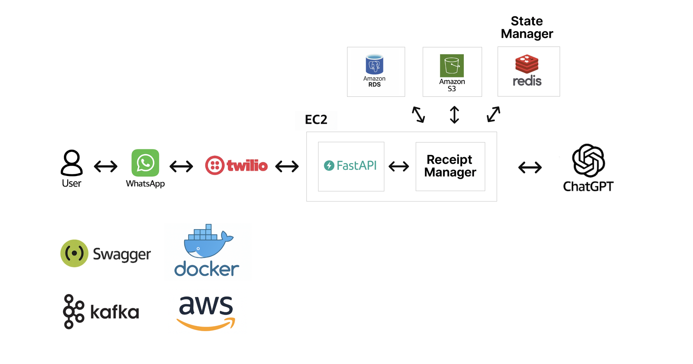

# WhatsApp Invoice Parsing Service

A microservices-based system that processes invoice images and natural language queries through WhatsApp using Twilio, Kafka, OpenAI GPT, AWS S3, and AWS RDS PostgreSQL. The system parses invoice data from images and converts natural language queries into SQL database queries for data retrieval and analysis.

---

## Table of Contents
- [System Architecture](#system-architecture)
- [Prerequisites](#prerequisites)
- [Quick Start](#quick-start)
- [4.1 Test Locally with Twilio Sandbox](#41-test-locally-with-twilio-sandbox)
- [AWS Setup Guide](#aws-setup-guide)
  - [1. S3 Bucket Creation](#1-s3-bucket-creation)
  - [2. RDS PostgreSQL Instance Setup](#2-rds-postgresql-instance-setup)
  - [3. EC2 Instance Setup](#3-ec2-instance-setup)
- [Database Schema](#database-schema)
- [System Integration Flow](#system-integration-flow)
- [Project Structure](#project-structure)

---

## System Architecture

The system runs on Docker containers (deployable to AWS EC2) hosting four key microservices:
- **Webhook Service**: Receives incoming WhatsApp messages via Twilio, manages user session state with Redis.
- **Invoice Extractor**: Analyzes images using GPT to extract invoice data, stores images in S3 and extracted metadata in RDS.
- **Query Generator**: Processes natural language queries using GPT to analyze data stored in the RDS database and generate Excel reports.
- **Client Response**: Manages responses back to users via Twilio/WhatsApp.

Supporting Infrastructure:
- **Kafka**: Facilitates asynchronous communication and task queuing between microservices.
- **Redis**: Used for state management, managing user conversation flow, and session data.
- **AWS RDS (PostgreSQL)**: Provides persistent storage for user data, extracted invoice information (`fintrak` database), and query history.
- **AWS S3**: Stores the invoice image files securely.



---

## Prerequisites

- Docker and Docker Compose
- AWS Account with permissions for:
    - EC2 (Instance creation, Security Group management)
    - RDS (Database creation, Security Group management)
    - S3 (Bucket creation, Object read/write access)
- Twilio Account with an active WhatsApp Sender
- OpenAI API key
- Python 3.9+ (for local development)

---

## Quick Start

### 1. Clone the repository

```bash
git clone https://github.com/DM-Dev-Codes/whatsapp-invoice-processor.git
cd whatsapp-invoice-processor
```

### 2. Set up environment variables

Create a `.env` file in the root directory. **Do not commit this file.** Use the following template:

```env
# AWS Credentials & Configuration
AWS_ACCESS_KEY_ID=your_access_key
AWS_SECRET_ACCESS_KEY=your_secret_key
AWS_REGION=your_aws_region # e.g., us-east-1
S3_BUCKET_NAME=your_unique_s3_bucket_name

# RDS PostgreSQL Configuration
RDS_HOST=your_rds_endpoint
RDS_PORT=5432
RDS_DATABASE=fintrak # Database name
RDS_USER=your_rds_username
RDS_PASSWORD=your_rds_password

# Twilio Configuration
TWILIO_ACCOUNT_SID=your_account_sid
TWILIO_AUTH_TOKEN=your_auth_token
TWILIO_PHONE_NUMBER=your_twilio_whatsapp_number # e.g., +14155238886

# OpenAI Configuration
GPT_API_KEY=your_openai_api_key

# Redis Configuration (Defaults for docker-compose)
REDIS_HOST=redis
REDIS_PORT=6379

# Kafka Configuration (Defaults for docker-compose)
KAFKA_HOST=kafka
KAFKA_PORT=9092
```

### 3. Build and Start the services

```bash
# First build the base image that all services depend on
docker build -t base -f Dockerfile.base .

# Then build and run all services
docker-compose up --build -d # Build images and run in detached mode
```

### 4. Configure Twilio Webhook

- In your Twilio console, navigate to the settings for your WhatsApp sender.
- Set the webhook URL for incoming messages to point to your deployed Webhook Service:
  `http://<your-ec2-public-ip-or-dns>:8000/whatsapp`
  (Ensure port 8000 is open in your EC2 Security Group).

---

## 4.1 Test Locally with Twilio Sandbox

### Twilio Account Setup

If you don’t already have a Twilio account:

1. Go to [https://www.twilio.com/](https://www.twilio.com/) and sign up for a free account.  
2. Verify your phone number and email address.  
3. Navigate to the [WhatsApp Sandbox](https://www.twilio.com/console/sms/whatsapp/sandbox).  
4. Note your Twilio Sandbox number and unique join code (e.g., `join example-word`).

### Connect and Test

1. Open WhatsApp on your mobile device.  
2. Send the join code to the Twilio sandbox number.  
3. In the Twilio Console, set the Webhook URL for incoming messages to:  
   `http://3.95.20.23:8000/whatsapp`  
4. Send a test message to the sandbox number via WhatsApp.  
5. Follow the on-screen prompts to:  
   - Upload and process an invoice image  
   - Submit a natural language financial query  

---

## AWS Setup Guide

This guide assumes basic familiarity with the AWS console.

### 1. S3 Bucket Creation

- Go to the S3 service in the AWS console.
- Create a new bucket. Choose a globally unique name and the desired region.
- Configure permissions:
    - Enable public access **only if required**, to allow external systems to retrieve files. Use with caution.
    - Attach the "AmazonS3FullAccess" policy to your user.
    - Example policy snippet:

    ```json
    {
        "Version": "2012-10-17",
        "Statement": [
            {
                "Effect": "Allow",
                "Principal": "*",
                "Action": [
                    "s3:GetObject"
                ],
                "Resource": "arn:aws:s3:::your_unique_s3_bucket_name/*"
            }
        ]
    }
    ```

- Note the `S3_BUCKET_NAME` and `AWS_REGION` for your `.env` file.

### 2. RDS PostgreSQL Instance Setup

- Go to the RDS service in the AWS console.
- Click "Create database".
- Choose "Standard Create" and select "PostgreSQL".
- Select a template (e.g., "Free tier" for development, or production tiers).
- Configure Settings:
    - **DB instance identifier**: e.g., `whatsapp-invoice-db`
    - **Master username**: Set your desired master username.
    - **Master password**: Set a strong password.
- Configure Instance configuration, Storage, and Availability & durability as needed.
- **Connectivity**:
    - Choose the VPC where your EC2 instances will run.
    - **Important**: Configure the VPC security group to allow inbound TCP traffic on port 5432 from the EC2 instance or its security group.
    - Set Public Access to "No" unless you have a specific reason and understand the security implications.
- **Database options**:
    - Set the **Initial database name** to `fintrak`.
- Create the database. Wait for it to become available.
- Note the **Endpoint** URL and **Port** for your `.env` file (`RDS_HOST`, `RDS_PORT`). Store the `RDS_USER`, `RDS_PASSWORD`, and `RDS_DATABASE` (`fintrak`) in `.env`.

### 3. EC2 Instance Setup

- Launch an EC2 instance (e.g., Ubuntu Server 22.04 LTS, t2.micro or larger).
- **Configure Security Group**:
    - Allow SSH (Port 22) from your IP address for management.
    - Allow Custom TCP (Port 8000) from Twilio's IP ranges (or `0.0.0.0/0` for testing, **not recommended for production**) for the WhatsApp webhook.
    - Ensure this security group is allowed inbound access to the RDS security group on port 5432.
- Connect to your EC2 instance using SSH.
- **Install Docker and Docker Compose**:

```bash
### 1. Update package index
sudo apt-get update -y

### 2. Install prerequisites
sudo apt-get install -y \
    ca-certificates \
    curl \
    gnupg \
    lsb-release

### 3. Add Docker’s official GPG key
sudo mkdir -p /etc/apt/keyrings
curl -fsSL https://download.docker.com/linux/ubuntu/gpg \
    | sudo gpg --dearmor -o /etc/apt/keyrings/docker.gpg

### 4. Set up the stable Docker repository
echo \
  "deb [arch=$(dpkg --print-architecture) signed-by=/etc/apt/keyrings/docker.gpg] \
  https://download.docker.com/linux/ubuntu \
  $(lsb_release -cs) stable" \
  | sudo tee /etc/apt/sources.list.d/docker.list > /dev/null

### 5. Install Docker Engine
sudo apt-get update -y
sudo apt-get install -y docker-ce docker-ce-cli containerd.io

### 6. Add current user to Docker group to avoid using 'sudo' with docker
sudo usermod -aG docker $USER

### 7. Activate the group changes (start a new shell or run below)
newgrp docker

### 8. Install Docker Compose v2 (plugin-based)
sudo apt-get install -y docker-compose-plugins

### ✅ Check installations
docker --version       # should return Docker version X.X.X
docker compose version # should return Docker Compose version v2.X.X
```

- Clone the repository onto the EC2 instance, create the `.env` file, and run `docker-compose up`.

---

## Database Schema

The system uses a PostgreSQL database named `fintrak` with tables including:
- **Users**: Stores WhatsApp user information (`whatsapp_number`, `username`, `created_at`).
- **Invoices**: Contains extracted invoice data (`invoice_id`, `whatsapp_number`, `invoice_date`, `expense_amount`, `vat`, `payee_name`, `payment_method`, `raw_image_url`, `created_at`).
- **Queries**: Tracks user financial analysis queries and results (`query_id`, `whatsapp_number`, `query_text`, `query_result`, `created_at`).

---

## System Integration Flow

The end-to-end flow involves multiple systems:
1. User sends a message via WhatsApp.
2. Twilio receives the message and forwards it to the configured webhook URL.
3. The **Webhook Service** presents a menu to users with two options:
    - Option 1: Process invoice image
    - Option 2: Submit natural language query
4. Based on the user's selection, the Webhook Service publishes the subsequent message to the appropriate Kafka topic:
    - Image processing requests → IMAGE_TOPIC
    - Natural language queries → QUERY_TOPIC
5. The appropriate service (**Invoice Extractor** or **Query Generator**) consumes the message from its topic.
6. Services interact with **OpenAI GPT** for analysis, **S3** for storage, and **RDS** for data persistence.
7. The **Client Response Service** formats the result and sends it back to the user via the Twilio API.

---

## Project Structure

The codebase is organized into microservices with shared utilities:

- `services/` - Contains the four microservices (webhook, invoice extraction, query generator, client response)
- `shared/` - Common utilities including Kafka integration, database connections, GPT API
- `docs/` - Contains the system architecture diagram (`system_architecture.png`)
